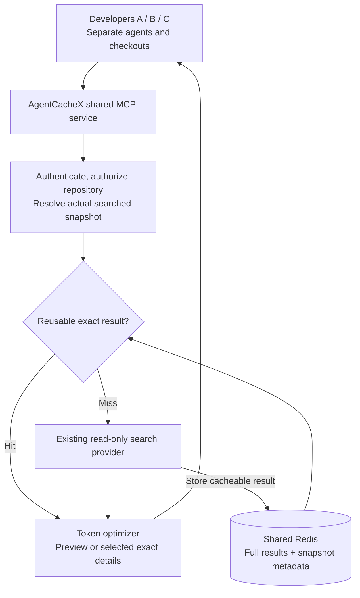

# AgentCacheX

**Shared repository lookups. Smaller agent context.**

Multiple developers working on the same repository repeat the same read-only code lookups and send oversized, repetitive results to their agents. AgentCacheX shares version-scoped tool results and returns only the details each agent needs.

**One repository, multiple developers, any programming language.** We wrap existing search tools; we do not build another code-analysis engine.

> **Status:** Proposed hackathon MVP, documentation, and presentations. The cache service, MCP tools, and benchmark harness are not implemented. The offline architecture viewer and presentation-generation script are documentation utilities, not the cache application.

## The solution in one minute

AgentCacheX is a **shared tool-result cache plus a token optimizer**:

1. Developer A's agent searches a committed repository snapshot through AgentCacheX.
2. On a miss, the service runs an existing search provider and stores its complete captured response in Redis.
3. The agent receives a compact preview with source locations, result IDs, and explicit pagination.
4. The agent requests selected details together, instead of loading everything.
5. Developer B repeats the same lookup against the same snapshot and authorized scope: the shared result is reused.

The **cache** reduces duplicate backend work. The **optimizer** reduces unnecessary tool output on both cache hits and misses. The agent still reasons and writes a new answer.



Dirty or unknown workspace/index states do not enter the shared-reuse path. A backend that cannot represent the requested state returns an explicit unsupported-state response rather than silently searching another revision.

## Two proposed tools

| Tool | What the agent receives |
|---|---|
| `search_compact(query, scope, response_budget, mode, cursor)` | A bounded preview or paginated complete match list, source snapshot, stable result IDs, and coverage information |
| `fetch_details(result_set_id, selections, response_budget, cursor)` | Selected exact snippets in one batch, from that same result snapshot, with any remaining selections explicitly identified |

These are proposed API names, not commands that can be run yet. Agents must be configured to use the wrapper; registering an MCP server does not automatically intercept other tools.

### A simple example

Both developers search for `VIP_DISCOUNT` at commit `abc123`.

| Step | Without progressive disclosure | With AgentCacheX |
|---|---|---|
| Initial lookup | Agent receives the entire large response | Full response stays in Redis; agent receives a compact index |
| Understanding the relevant code | Agent processes every returned snippet | Agent selects two results and fetches their details together |
| Another authorized developer repeats the lookup | Provider may repeat the same work | Same raw result can serve a differently sized preview |
| Source changes to commit `def456` | Search must target the new code | New snapshot produces a new cache key |

For illustration only: **10,000 raw tool-output tokens -> 300 preview tokens + 1,200 selected-detail tokens = 1,500 tokens**. That is an illustrative **85% tool-payload reduction**, not a measured result or a promise about total task tokens, latency, or billed cost. Additional retrieval turns and repeated conversation history also cost tokens.

## Minimal components and why

| Component | Role |
|---|---|
| Shared MCP service | One endpoint used by multiple developers; proposed .NET/ASP.NET Core host with the official MCP C# SDK |
| Access and snapshot gate | Ensure both callers may see the data and that results identify the source actually searched |
| Existing provider adapter | Run the existing tool on a miss; a pinned-commit `git grep` adapter is the recommended first baseline |
| Redis | Share immutable captured results, query pointers, expiration, and coordination for concurrent misses |
| Deterministic token optimizer | Preserve exact source text, group metadata, remove duplicate snippets, and support preview/detail retrieval |
| Metrics | Count backend executions, total task tokens, latency, and answer quality |

The Git pilot provides **text matches, not semantic symbol references or call graphs**. Later providers can expose their existing semantic capabilities without AgentCacheX implementing them. Roslyn is C#-specific and is **not an MVP dependency**. The service's implementation language does not restrict the repository's languages.

One service and one Redis instance support team sharing; this is not yet a highly available distributed cluster. Share a service, not a live database file through OneDrive.

## Correctness rules

- **Share by result identity:** repository ID + actual source/index snapshot + provider/tool version + canonical upstream arguments + effective access scope + schema version. Do not automatically partition every key by developer username.
- **Authorize every request:** including detail handles and pagination. A result ID is not permission to read it.
- **Keep snapshots explicit:** share clean committed results; bypass shared caching for dirty, unsaved, or unverifiable states. Never trust a model-supplied commit or `clean=true` as proof.
- **Make omissions visible:** preserve source locations and exact text; paginate exhaustive requests. A partial provider response is not complete repository coverage.
- **Expire honestly:** Redis TTL controls retention, not source freshness. An evicted result ID returns `RESULT_EXPIRED`, not "no matches."
- **Count what matters:** response budgets include metadata. Label token estimates, and measure all model turns rather than equating shorter tool output with lower total cost.

The [high-level design](AgentCacheX-High-Level-Design.md) defines the flows, contracts, failure behavior, and measurement plan.

## Current design and presentations

| File | Purpose |
|---|---|
| [PROJECT-CONTEXT.md](PROJECT-CONTEXT.md) | Team handoff, fixed scope, decisions, demo, and workstream boundaries |
| [AgentCacheX-High-Level-Design.md](AgentCacheX-High-Level-Design.md) | Component responsibilities, cache identity, two-tool contract, optimizer, and evaluation |
| [AgentCacheX-Architecture.html](AgentCacheX-Architecture.html) | Offline interactive diagrams with zoom, accessible descriptions, Mermaid export, and Print/PDF |
| [AgentCacheX-Coding-Agent-Cache.pptx](AgentCacheX-Coding-Agent-Cache.pptx) | Updated problem, solution, team reuse, and focused MVP story |
| [AgentCacheX-Keynote-Style.pptx](AgentCacheX-Keynote-Style.pptx) | The same current scope in a keynote-style presentation |
| [AgentCacheX-Neon-Architecture.pptx](AgentCacheX-Neon-Architecture.pptx) | The same current scope with a neon architecture theme |

Open the HTML locally; GitHub's file view does not execute it:

```powershell
git clone https://github.com/Avish34/AgentCacheX.git
Set-Location .\AgentCacheX
Start-Process .\AgentCacheX-Architecture.html
```

The decks use editable native PowerPoint text and shapes: ten slides per theme, with speaker notes. Their generator is [scripts/build_presentations.py](scripts/build_presentations.py); its Python dependency is pinned in [scripts/requirements-presentations.txt](scripts/requirements-presentations.txt). It does not load the original decks or need SVG/PNG assets. Close the presentations before regenerating:

```powershell
python .\scripts\build_presentations.py
```

The previously requested video has been removed.

## Historical research and decisions

The following remain available as **historical inputs, not the current implementation plan**. Earlier evidence-card, analyzer, SQLite/FTS5, vector, and graph-memory recommendations have been superseded by the focused shared-cache MVP.

| File | Historical content |
|---|---|
| [RESEARCH-STORAGE.md](RESEARCH-STORAGE.md) | SQLite, sqlite-vec, Qdrant, Redis/RedisVL, and GPTCache comparisons |
| [RESEARCH-MEMORY-FRAMEWORKS.md](RESEARCH-MEMORY-FRAMEWORKS.md) | Graphiti, Mem0, and LlamaIndex source review |
| [sharedrp-agent-memory-layer-research-2026-08-31.md](sharedrp-agent-memory-layer-research-2026-08-31.md) | Original SharedRP-oriented research |
| [GeminiResponse.txt](GeminiResponse.txt) | Original brainstorming; market and competitor claims are not established findings |
| [CONVERSATION.md](CONVERSATION.md) | Design evolution, including the simplification to this MVP |

The decks have been refactored in place; their original versions remain in Git history. Earlier performance projections are not current product results.

## Build the focused MVP

- [ ] One repository and a snapshot-pinned existing provider.
- [ ] Shared Redis cache, permission-aware keys, expiration, and concurrent-miss coalescing.
- [ ] `search_compact` and batched `fetch_details` with deterministic budget accounting.
- [ ] Two separate developer sessions demonstrating cross-user reuse.
- [ ] Changed-snapshot, unsupported-workspace, expiration, pagination, and access-boundary scenarios.
- [ ] Comparison with the provider's already-filtered output, including total model tokens and answer quality.

**Not in this MVP:** custom semantic analysis, Roslyn/LSP integration, embeddings, vector/graph databases, evidence-card generation, fine-grained dependency invalidation, or replaying answers, edits, and shell commands.

Work in separate clones, branches, and agent sessions; integrate through pull requests. [Avish34/AgentCacheX](https://github.com/Avish34/AgentCacheX) is public for viewing, cloning, forking, and pull requests. Direct write access still requires a collaborator invitation.
