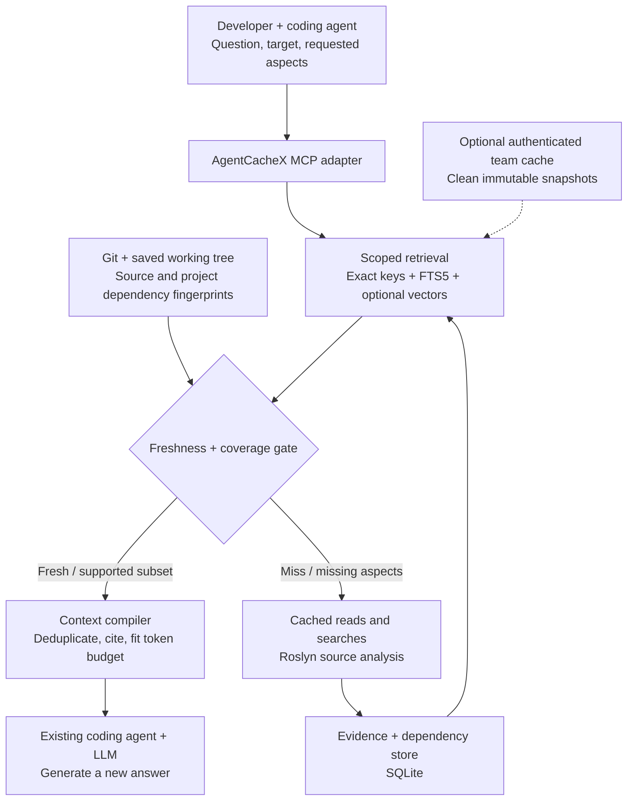

# AgentCacheX

**Repository-aware evidence caching for coding agents.**

AgentCacheX aims to stop coding agents from repeatedly rediscovering unchanged code. It reuses source-backed evidence, checks that the relevant repository inputs still match, and supplies compact, cited context to the answering model.

> **Status:** Hackathon research, architecture, and presentation materials. The cache service, MCP tools, and benchmarks are proposed, not implemented. The interactive architecture diagram is a working, standalone documentation artifact.

## The problem

Different developers and agents repeatedly read the same files, search the same symbols, trace the same dependencies, and rebuild context. This costs tool calls, model tokens, and time even when the relevant code has not changed.

The goal is to reuse that work **without treating stale code knowledge or unsupported generated summaries as current truth**.

## Proposed solution



The unit of reuse is an **evidence card**, not a final answer, patch, or shell trajectory. Each card retains its source location, observed snapshot, content/dependency fingerprints, evidence strength, and analysis versions.

## Start here

| File | What it contains |
|---|---|
| [PROJECT-CONTEXT.md](PROJECT-CONTEXT.md) | Team handoff: problem, scope, decisions, assumptions, workstreams, and open questions |
| [AgentCacheX-High-Level-Design.md](AgentCacheX-High-Level-Design.md) | Full design, six alternatives, storage/framework comparisons, contracts, correctness rules, deployment, evaluation, and sources |
| [AgentCacheX-Architecture.html](AgentCacheX-Architecture.html) | Offline interactive diagram: request flow, storage/invalidation, and team sharing; includes Mermaid export and Print/PDF |
| [RESEARCH-STORAGE.md](RESEARCH-STORAGE.md) | Detailed storage/cache research: SQLite, sqlite-vec, Qdrant, Redis/RedisVL, and GPTCache |
| [RESEARCH-MEMORY-FRAMEWORKS.md](RESEARCH-MEMORY-FRAMEWORKS.md) | Detailed framework research: Graphiti, Mem0 OSS, LlamaIndex, and MCP integration caveats |
| [CONVERSATION.md](CONVERSATION.md) | Project conversation through research, design, diagrams, and the repository request |

## Original materials

These inputs are retained in their original files rather than replaced by summaries.

| File | Purpose |
|---|---|
| [AgentCacheX-Coding-Agent-Cache.pptx](AgentCacheX-Coding-Agent-Cache.pptx) | Focused MVP, problem, cold/warm example, impact assumptions, and pilot plan |
| [AgentCacheX-Keynote-Style.pptx](AgentCacheX-Keynote-Style.pptx) | Original presentation variant; unavailable for text extraction during the initial review because it was open/locked |
| [AgentCacheX-Neon-Architecture.pptx](AgentCacheX-Neon-Architecture.pptx) | Architecture, evidence flow, source freshness, context reduction, and demo narrative |
| [GeminiResponse.txt](GeminiResponse.txt) | Original product and market brainstorming response; its market and competitor claims are not established research findings |
| [sharedrp-agent-memory-layer-research-2026-08-31.md](sharedrp-agent-memory-layer-research-2026-08-31.md) | Original SharedRP-oriented memory-layer research that informed the generalized AgentCacheX design |

The September 11 design and source-pinned research refine the earlier brainstorming. All performance figures in the decks remain illustrative until measured.

## View the diagrams

GitHub renders the Mermaid overview in this README. To use the interactive diagram, clone or download this repository and open `AgentCacheX-Architecture.html` locally. GitHub's source-file view does not execute the HTML.

```powershell
git clone https://github.com/Avish34/AgentCacheX.git
Set-Location .\AgentCacheX
Start-Process .\AgentCacheX-Architecture.html
```

The HTML is self-contained: no external scripts, fonts, or network requests. Use its tabs for the three architecture views, zoom controls for detail, **Download Mermaid** for editable diagram source, or **Print / PDF** for a shareable document.

## Recommended stack

| Layer | Initial choice |
|---|---|
| Application / integration | C#/.NET and the official MCP C# SDK |
| Source understanding | Roslyn plus Git and explicit saved-workspace snapshots |
| Authoritative storage | SQLite relational records |
| Retrieval | Exact identifier/path keys and SQLite FTS5 |
| Optional semantic recall | A reviewed embedding provider and sqlite-vec |
| Cross-developer reuse | Authenticated service for clean immutable snapshots |
| Later scale-out | PostgreSQL authority and optional Qdrant retrieval index |

LlamaIndex is a candidate for selective ingestion reuse, not a required Python sidecar. Graphiti and Mem0 are not the source-freshness authority. Redis is not required for the MVP.

## Non-negotiable design rules

1. Similarity finds candidates; source and dependency checks determine whether reuse applies.
2. HEAD alone is insufficient: dirty/new files, configuration, references, and binding changes matter.
3. Freshness and semantic correctness are separate. Prefer exact excerpts and deterministic facts; label derived summaries.
4. Missing validation or incomplete dependency coverage must not silently become a fresh hit.
5. MCP capture is explicit; unrelated tools and unsaved editor buffers are not automatically visible.
6. A local-only cache does not demonstrate cross-developer reuse.
7. Runtime databases belong on local disk outside OneDrive and outside Git. Share a service, not a live SQLite file.

## Hackathon plan

- [ ] Exact cache and MCP acquisition tools.
- [ ] Roslyn evidence cards, source citations, FTS5, and bounded context compilation.
- [ ] Working-tree/project freshness, invalidation, and partial results.
- [ ] Optional semantic recall, justified against the lexical baseline.
- [ ] Authenticated team reuse for clean snapshots.
- [ ] Cold/warm/change demo with measured quality, cost, and latency.

The proposed tool contracts are `cache_lookup`, `code_read_cached`, `code_search_cached`, `cache_record`, and `cache_explain`. They are design names, not currently runnable commands.

## Work in parallel

Use separate clones/checkouts, branches, and agent sessions. Read `PROJECT-CONTEXT.md` and agree on the snapshot, evidence-card, and lookup-response contracts before implementation.

Suggested workstreams are storage/retrieval, source/freshness, MCP/context compilation, and evaluation/demo. Integrate through pull requests rather than concurrently editing a shared OneDrive working directory.

This repository is public: anyone can view, clone, and fork it at [github.com/Avish34/AgentCacheX](https://github.com/Avish34/AgentCacheX). Contributors can propose changes through forks and pull requests. Public visibility does not grant direct write access; the owner must still invite collaborators for that.

## Evidence and performance

The design compares against provider prompt caching, exact tool caching, and incremental code RAG. The more complex evidence layer should earn its place.

The deck's 8,000-to-1,500 input-token example is approximately 81% reduction **on a warm hit**. At a hypothetical 60% usable hit rate, it implies approximately 49% workload-wide reduction before overhead. Neither number is a measured product result.

Primary sources and pinned implementation references are included in the design and research reports. Source review is not a substitute for package compatibility checks or workload measurements.
